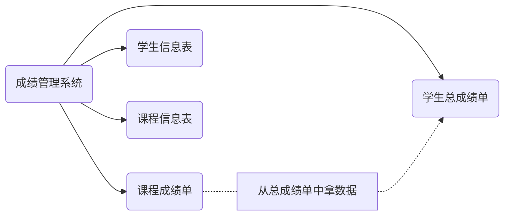
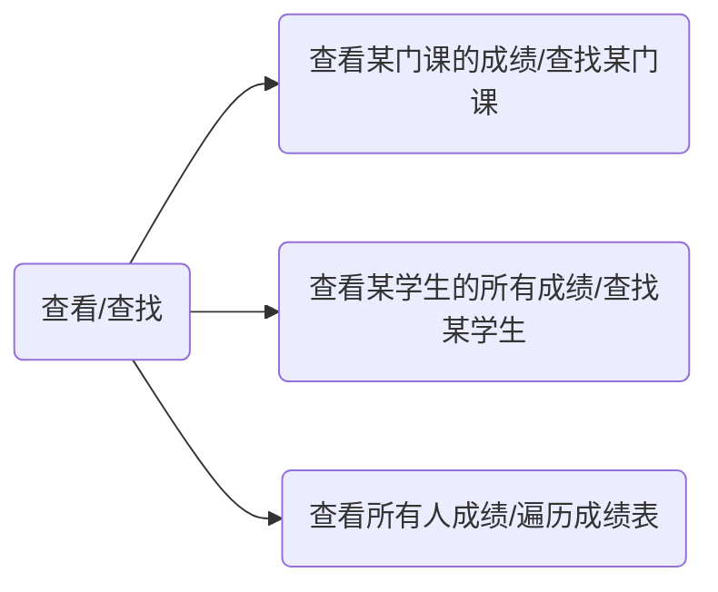
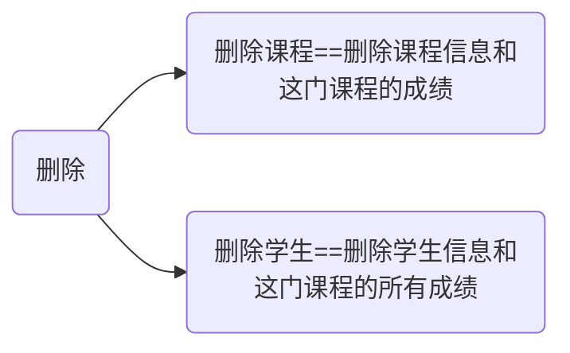
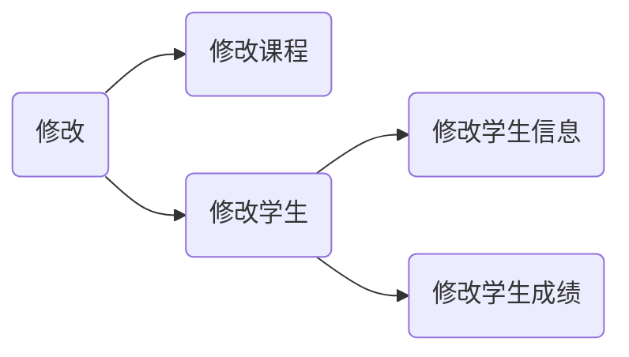
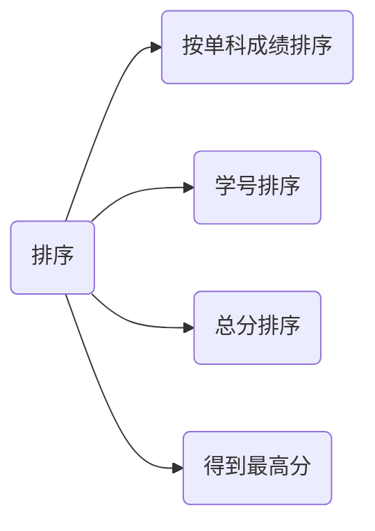

[toc]


# 成绩管理系统

## 效果展示

### 登录

#### 自动登录_成功


#### 手动登录_成功


#### 手动登录_失败测试


### 自动加载文件信息（增加信息）


### 删除

#### 删除课程


#### 删除学生


### 查看


### 修改

#### 修改课程信息


#### 修改学生成绩


#### 修改学生信息


### 排序

#### 按学号进行排序


#### 按总分进行排序


#### 找到单科最高分


#### 按单科成绩进行排序


## 代码前铺垫

写代码前肯定是要设计好类的。




### 分析

成绩管理系统，包含学生总成绩单，课程成绩单，学生信息表，课程信息表。其中课程成绩单和学生总成绩单存在数据相同，所以需要处理数据冗余的问题，所以我决定只存一份数据，课程成绩单的数据从总成绩单获取，此时我修改总成绩单自然课程成绩单也随之改变。、

### 结构

链表，顺序表，堆栈，树等用哪种结构好一点？

成绩管理常用的肯定的增删查，修改倒不频繁。在增删方面顺序表和链表各有优劣，堆栈不好查找。显然对于增删查来说红黑树是一种很好的结构，对应到STL里就是map和set了

>此处印证了学习二叉搜索树时的一个观点：二叉搜索树是对链表和顺序表的一种折中
>
>传送门👉👉[二叉搜索树笔记及模拟实现_](https://blog.csdn.net/m0_53005929/article/details/124414105?spm=1001.2014.3001.5501)

### 代码风格

少用typedef，避免函数的多层嵌套，基于这两点我对代码进行了一次重写，使其尽量结构清晰和好理解

> 少用typedef：保证代码的可读性，不然一个类型辗转几个typedef确实离谱
>
> 避免多层嵌套:在阅读代码时把我们的脑子比作一个栈，比如从函数A跳到另一个函数B时我们肯定要保存进入函数B时A的状态，之后还得一层一层递归回来，所以嵌套层数太多后我们就记不住了。。。所以建议避免多层嵌套
>
> 此外，为了代码的结构尽可能清晰，采用了多个宏定义，但其实写完后，觉得用函数代替可能好一点。因为宏的缺点之一就是不好调试，写代码过程中出了bug不好调试，但是用宏又更方便，此处各有利弊，可以根据自己的需求自己选择...

### 用到的知识点

- C++的入门语法即IO流相关知识
- 缓冲区相关知识，用来处理非法输入和输入加密（即输入的密码会被*代替）。
- STL容器的使用，其中包括对map进行自定义类型排序和构造自定义类型的map/set。
- 些许Windows编程   ~~我也只是套壳使用~~

手动输入错误数据可能导致原有数据被删除 这个得对输入数据进行判断

## 代码分析

### **<font color=40E0D0>GradeManagement.h</font>**

这里声明了需要用到的类型，如下图所示


#### 一门课程的成绩

```c++
enum TestStatus//考试状态
{
	NotNormal,
	Normal
};
struct CourseGrade
{
	friend class GradeTable;
	friend void Output();
	CourseGrade(){}
	CourseGrade(int couid)
		:_cou_id(couid)
	{}
	int _cou_id;
	int _grade;
	TestStatus _ts;
	//这里必须重载小于
	bool operator<(const CourseGrade& course_grade) const
	{
		if (course_grade._cou_id < _cou_id)
		{
			return true;
		}
		return false;
	}
	friend ostream& operator<<(ostream& out, const CourseGrade& cou);
};
```


#### 学生信息和课程信息

```c++
struct Student
{
	friend void Output();
	int _id;//默认学号八位 对非法输入进行处理
	size_t _age = 0;
	string _sex = "男";
	string _name = "张三";
	bool operator<(const Student& stu)
	{
		if (_id < stu._id)
		{
			return true;
		}
		return false;
	}
};
struct Course
{
	friend void Output();
	int _id;
	string _name;
	double _credit;
	set<string> _teacher_name;
};
```


#### 学生信息表

```c++
class StuTable//学生信息表
{
public:
	friend void Erase();
	friend void Update();
	friend void Sort();
	friend void Output();
	friend class GradeTable;
	void LoadingFile_Stu();
	void Hand_EnterInfo();
private:
	map<int, Student> _stu_table;//学号与学生信息对应
	bool Judge(int stuid)//学号存在返回false 不存在返回true
	{
		pair<map<int, Student>::iterator, bool>judge = _stu_table.insert(make_pair(stuid, Student()));
		return judge.second;
	}
};
```


#### 课程信息表

```c++
class CouTable//课程信息表
{
public:
	friend ostream& operator<<(ostream& out, const CourseGrade& cou);
	friend void Erase();
	friend void Update();
	friend void Sort();
	friend void Output();
	void LoadingFile_Cou();
	void Hand_EnterInfo();
private:
	map<int, Course> _cou_table;//课程号和课程
	bool Judge(int couid)
	{
		pair<map<int, Course>::iterator, bool>judge = _cou_table.insert(make_pair(couid, Course()));
		return judge.second;
	}
};
```


#### 总成绩单

```c++
class GradeTable
{
public:
	friend void Erase();
	friend void Output();
	friend void Update();
	friend void Sort();
	void LoadingFile_Grade();
	void Hand_EnterGrade();
	//这里就是输出成绩单  对成绩进行排序等操作 找出成绩最好的成绩等
private:
	map<int, set<CourseGrade>> _stu_grade;//学号--成绩  关联学号和自己的成绩  成绩单
	bool Judge(int stuid,int couid)//课程成绩已经存在返回false 不存在返回true
	{
		set<CourseGrade>& PersonGrade = _stu_grade[stuid];
		for (auto e : PersonGrade)
		{
			if (e._cou_id == couid)
			{
				return false;
			}
		}
		return true;
		
	}
};
```


#### 课程成绩单

```c++
class CouseGradeTable//对课程成绩单进行操作 
{
public:
	friend void Erase();
	friend void Output();
	friend void Update();
	friend void Sort();
	friend void GradeTable::LoadingFile_Grade();
	friend void GradeTable::Hand_EnterGrade();
private:
	map<int, set<int>>_cou_grade;//课程号--学号集合  课程成绩单要成绩从成绩单里去拿

};
```


### **<font color=40E0D0>operator.h</font>**

#### 用来输入的宏

op是一个变量，输入op来对成绩单进行相应的操作，由于op使用十分频繁

所以定义一个了一个宏来进行相应的处理。

- 输入合理的非0值-->正常运行

- 输入合理的0值-->退出当前操作，代码表现为直接return结束函数

- 输入非法制-->打印错误信息再退出

```c++
#pragma once
#include "GradeManagement.h"
StuTable stable;
GradeTable gtable;
CouTable ctable;
CouseGradeTable cgtable;

#define _OP_SITUATION op = InputOp(op, optional, sop);\
switch (op)\
{\
case -1:\
	PrintError();\
	return;\
case 0:\
	return;\
case 1:\
	break;\
}	
```


#### 打印菜单的宏

MENU就是一个打印菜单的宏，使用MENU就会打印菜单

>  **op输入1就是录入学生信息**

```c++
#define MENU printf("****************************************************\n");\
printf("*                                                  *\n");\
printf("*                   成绩管理系统                   *\n");\
printf("*                                                  *\n");\
printf("*                                                  *\n");\
printf("*                   1.录入学生信息                 *\n");\
printf("*                   2.录入课程信息                 *\n");\
printf("*                   3.录入学生成绩                 *\n");\
printf("*                   4.查看                         *\n");\
printf("*                   5.删除                         *\n");\
printf("*                   6.修改                         *\n");\
printf("*                   7.按成绩进行排序               *\n");\
printf("*                   8.自动录入信息                 *\n");\
printf("*                   0.退出                         *\n");\
printf("*                                                  *\n");\
printf("****************************************************\n");
```


#### 登录失败后用于重新登录的宏

进入成绩管理前需要先进行登录，登陆失败后需要对失败的情况进行处理

```c++
#define _AGAIN_LOGIN cout << endl;\
system("color 0c"); system("cls");\
printf("\n\n自动登录失败,请重新输入\n");\
printf("****************************\n\n");\
printf("1.手动登录 2.自动登录 0. 退出\n\n");\
printf("****************************\n");\
printf("请输入：-> ");\
_OP_SITUATION \
system("cls");
```


> system("cls")是什么？Windows下C++的输出终端是控制台（就是那个黑框框,也可以说是cmd）
>
> system("cls") 就相当于在cmd界面输入cls命令，cmd中cls命令的作用是清屏
>
> system("color 0c")表示在cmd下输入”color 0c“命令,color xy表示更改背景和字体颜色，x表示背景，y表示字体
>
> 


#### 检查学生和课程属性的合理性

```c++
#define _CHECK_STU_NAME(name)  if (name.size() <= 0 || name.size() > 50) {PrintError();stable._stu_table.erase(stuid); return;} \
for (auto e : name)\
{\
	if (e >= '0' && e <= '9') {PrintError();stable._stu_table.erase(stuid);return;}\
}//规定学生姓名中不能有数字且名字不能过长
#define  _CHECK_STU_ID(id) if (id < 10000000 || id>99999999) {PrintError();stable._stu_table.erase(stuid); return;}//规定学号必须是8位
#define  _CHECK_AGE(age) if (age < 0 || age >= 200) {PrintError();stable._stu_table.erase(stuid); return;}//规定学生年龄在0-200之间
#define _CHECK_SEX(sex) if (sex != "男" && sex != "女") {PrintError();stable._stu_table.erase(stuid); return;}//规定性别只有男女

#define _CHECK_COURSE_NAME(name)  if (name.size() <= 0 || name.size() > 50) {PrintError();ctable._cou_table.erase(couid); return;} \
for (auto e : name)\
{\
	if (e >= '0' && e <= '9') {PrintError();ctable._cou_table.erase(couid); return;}\
}//规定老师姓名中不能有数字且名字不能过长
#define _CHECK_COURSE_ID(id) if(id<0||id>10000)  {PrintError();ctable._cou_table.erase(couid); return;}//规定学号在1-1000之间
#define _CHECK_COURSE_NAME(name)  if (name.size() <= 0 || name.size() > 50||(name[0]>='0'&&name[0]<='9'))\
{PrintError(); ctable._cou_table.erase(couid); return;} //规定课程名字不能太长且第一个字符不能是数字

#define _CHECK_CREDIT(credit)  if(credit<0||credit>30) {PrintError();  ctable._cou_table.erase(couid); return;}//规定学分在0-30之间

#define _GIVE_TEST_STATIS(ts)  if (ts == 0)\
{\
	cousegrade._ts = NotNormal;\
	cousegrade._grade = 0;\
}\
else\
{\
	cousegrade._ts = Normal;\
}//根据输入的ts给考试一个状态（ts为0表示考试状态不正常，如作弊缺考等,ts为1表示考试状态正常）
```


#### 检查输入是否合理


展开代码

```c++
vector<int>op_01;
vector<int>op_012;
vector<int>op_04;
vector<int>op_05;
vector<int>op_09;
void InitOption()//初始化op_xx数组
{
	for (int i = 0; i <= 1; i++)
	{
		op_01.push_back(i);
	}
	for (int i = 0; i <= 2; i++)
	{
		op_012.push_back(i);
	}
	for (int i = 0; i < 4; i++)
	{
		op_04.push_back(i);
	}
	for (int i = 0; i < 5; i++)
	{
		op_05.push_back(i);
	}
	for (int i = 0; i < 9; i++)
	{
		op_09.push_back(i);
	}
}
void SetColor(int hex );
bool CheckOp(int& op,set<int>&sop )//检查sop里是否存在op
{
	if (sop.find(op)!=sop.end())
	{
		return true;
	}
	return false;
}
void InitSetOp(vector<int>& optional, int n, set<int>& sop)//用optional的值初始化sop
{
	for (int i = 0; i < n; i++)
	{
		sop.insert(optional[i]);
	}
}
int InputOp(int& op,vector<int>& optional, set<int>& sop)
{
	InitSetOp(optional,optional.size() , sop);
	cin >> op; 
	if (cin.bad())
	{
		SetColor(0x04);
		cout << "IO流出现未知错误" << endl;
		return -1;
	}
	else if (cin.fail())
	{
		SetColor(0x04);
		cout << "缓冲区出现脏/残留数据,致使输入错误" << endl;//简单来说cin没有读到数据
		cin.clear();
		cin.ignore(INT_MAX,'\n');		
		return -1;
	}
	else if(CheckOp(op, sop))
	{
		char ch = getchar();				
		if (ch == '\n' || ch == ' ')//看后面有无多余的数据 处理如”6vybuij“这样的数据
		{
			return op;
		}
		else
		{
			return -1;
		}
		/*string str;//若要提取非法数据可以用这种办法（前提是有非法数据）
		getline(cin, str);
		if (str.empty())
		{
			return op;
		}*/	
	}
	else
	{
		cin.ignore(INT_MAX, '\n');
		return -1;
	}	
}
void PrintError()
{
	SetColor(0x04);
	printf("\n\n输入有误,退出当前界面\n\n");
	Sleep(1200);
}
```

> 其中函数InputOp(）十分重要。可以参考代码注释
>
> cin本质是istream实例化出来的一个对象  所以可以调用成员函数
>
> [std::basic_istream - C++中文 - API参考文档 (apiref.com)](https://www.apiref.com/cpp-zh/cpp/io/basic_istream.html)
>
> [std::basic_istream::ignore - C++中文 - API参考文档 (apiref.com)](https://www.apiref.com/cpp-zh/cpp/io/basic_istream/ignore.html)
>
> 此外，网上查阅资料说cin.sync() 可以清空流，我用VS测试后发现不行，可能是由于编译器实现不同导致没达到清空缓冲区的效果
>
> 于是用cin.ignore(INT_MAX, '\n');代替
>
> cin.ignore()  得给两个参数，不给参数会死循环,因为ignore第一个参数的缺省值是1，即只忽略一个字符，第二个参数默认的缺省值是EOF
>
> 缓冲区最后一个字符不是EOF
>
> ```c++
> //测试cin.sync()
> int test3()
> {
> 	int op;
> 	cin >> op;
> 	if (cin.bad())
> 	{
> 		cout << "IO流出现未知错误" << endl;
> 	}
> 	else if (cin.fail())
> 	{
> 		cout << "缓冲区出现脏/残留数据" << endl;
> 		cin.clear();
> 		cin.ignore(INT_MAX,'\n');//读到\n停止
> 		/*if (cin.sync() == 0)//测试无效
> 		{
> 			printf("成功清除流\n");//成功执行cin.sync()返回0
> 		}*/
> 	}
> 	cout << op << endl;
> 	return 0;
> }
> //测试输入：buijnklgiubn
> ```


#### 录入学生信息

读取文件或者是手动录入，手动录入的信息会再次被写进文件，以便下次直接读取


> [C++如何判断文件为空 | rootcheese](https://rootcheese.com/?p=411)
>
> 值得一提的是文本文件的格式和文件如何判空
>
> 

```c++
void StuTable::LoadingFile_Stu()
{
	ifstream ifs("stu_info.txt");
	if (!ifs)
	{
		cout << "学生信息文件不存在" << endl;
		return;
	}
	int stuid;
	char ch;
	ifs >> ch;//文件为空时会有一个字符 得先把这个字符读出来  (文件打开是初始化状态，读到EOF系统才会把文件状态更改为文件尾
	//eof()是根据文件状态来判断文件是否为空  所以得先尝试读取一个字符改变其状态
	if (ifs.eof())
	{
		cout << "文件为空" << endl;
		return;
	}
	while (!ifs.eof())//文件的最后一行别加换行 不然没读到尾导致最后一行数据读两次
	{
		ifs >> stuid;
		if (Judge(stuid)==false)
		{
			//printf("读取到重复数据，请勿重复读取\n");
			//return;
			_stu_table.erase(stuid);//有的话就删掉再插入实现覆盖
		}
		_stu_table[stuid]._id = stuid;
		ifs >> _stu_table[stuid]._name;
		ifs >> _stu_table[stuid]._age;
		ifs >> _stu_table[stuid]._sex;
	}	
	cout << "学生信息录入完毕" << endl;
}
void StuTable::Hand_EnterInfo()
{
	ofstream ofs("stu_info.txt",ios_base::app);
	int stuid;
	printf("请输入学号：-> "); 
	cin >> stuid;	 
	if (Judge(stuid)==false)
	{
		printf("该学生已经存在 此次输入将会覆盖原本信息 是否继续？\n");
		printf("0. 退出 1. 继续\n");
		int op; 
		printf("请输入：-> ");
		vector<int>optional(op_01);
		set<int>sop;
		_OP_SITUATION
	}
	stable._stu_table.erase(stuid);
	Student& input = stable._stu_table[stuid];		_CHECK_STU_ID(stuid)
		input._id = stuid;
	printf("请输入姓名：-> "); cin >> input._name;	_CHECK_STU_NAME(input._name)  
	printf("请输入年龄：-> "); cin >> input._age;		_CHECK_AGE(input._age) 
	printf("请输入性别：-> "); cin >> input._sex;		_CHECK_SEX(input._sex)
		ofs << '\n' << '\n' << stuid;
	ofs << " " << input._name; 
	ofs << " " << input._age;	
	ofs << " " << input._sex;
	printf("录入成功\n");
	
}
void Input_EnterStuInfo()
{
	int op;	
	printf("1.加载学生信息文件   2.手动录入  0.退出\n");
	printf("请输入：-> "); 
	vector<int>optional(op_012);
	set<int>sop;
	_OP_SITUATION
	while (op)
	{
		if (op == 1)
		{
			stable.LoadingFile_Stu();
		}
		else if (op == 2)
		{
			stable.Hand_EnterInfo();
			 
		}
		else if(op==0)
		{
			break;
		}
		else
		{
			cout << "输入错误，退出。" << endl;
			break;
		}
		printf("\n继续录入吗？"); printf("1.加载学生文件   2.手动录入  0.退出\n");
		printf("请输入:-> "); 
		_OP_SITUATION
	}
}
```

#### 录入课程信息

和录入学生信息同理


```c++
void CouTable::LoadingFile_Cou()
{
	ifstream ifs("cou_info.txt");
	FILE* pf=fopen("cou_info.txt","r");
	
	if (!ifs)
	{
		cout << "课程信息文件不存在" << endl;
		return;
	}
	int couid;
	char ch;
	ifs >> ch;//文件为空时会有一个字符 得先把这个字符读出来
	if (ifs.eof())
	{
		cout << "文件为空" << endl;
		return;
	}
	while (!ifs.eof())//文件的最后一行别加换行 不然没读到尾导致最后一行数据读两次
	{
		ifs >> couid;
		if (Judge(couid) == false)
		{
			/*printf("读取到重复数据，请勿重复读取\n");
			return;*/
			_cou_table.erase(couid);//有的话就删掉再插入实现覆盖
		}
		_cou_table[couid]._id = couid;
		ifs >> _cou_table[couid]._name;
		ifs >> _cou_table[couid]._credit;
		ch = ' '; string teacher_name;
		while (ch != '\n'&&ch!=EOF)
		{
			ifs >> teacher_name;
			_cou_table[couid]._teacher_name .insert(teacher_name);
			ch = ifs.get();			
		}
	}
	cout << "课程信息录入完毕" << endl;
}
void CouTable::Hand_EnterInfo()
{
	ofstream ofs("cou_info.txt", ios_base::app);//追加
	int couid;
	printf("请输入课程号：-> "); cin >> couid;	
	if (Judge(couid) == false)
	{
		printf("该课程已经存在 此次输入将会覆盖原本信息 是否继续？\n");
		printf("0. 退出 1. 继续\n");
		int op;
		printf("请输入：-> ");
		vector<int>optional(op_01);
		set<int>sop;
		_OP_SITUATION
	}
	ctable._cou_table.erase(couid);
	Course& input = ctable._cou_table[couid]; _CHECK_COURSE_ID(couid)
	input._id = couid;
	printf("请输入课程名：-> "); cin >> input._name;	_CHECK_COURSE_NAME(input._name)
	printf("请输入学分：-> "); cin >> input._credit;	_CHECK_CREDIT(input._credit)
	printf("您可以输入多位老师的名字，中间用空格间隔即可\n");
	printf("请输入授课老师名字：->");
	string str; getchar();
	getline(cin, str);  _CHECK_COURSE_NAME(str)
	for (int i = 0; i < str.size(); )
	{
		int left = i;
		int right = left + 1;
		while (right < str.size() && str[right] != '\0')
		{
			if (str[right] == ' ')
			{
				 break;
			}
			else
			{
				right++;
			}
		}
		i = right;
		string ans = str.substr(left, right);
		ans += '\0';
		_cou_table[couid]._teacher_name.insert(ans);
	}
	ofs << "\n\n" <<setw(4)<<setfill('0')<< couid << ' ' << input._name << ' ' << input._credit << ' ' << str;
	printf("录入成功\n");
	
}
void Input_EnterCouInfo()
{
	int op;
	printf("1.加载课程信息文件   2.手动录入  0.退出\n");
	printf("请输入：-> "); 
	vector<int>optional(op_012);
	set<int>sop;
	_OP_SITUATION
	while (op)
	{
		if (op == 1)
		{
			ctable.LoadingFile_Cou();
		}
		else if (op == 2)
		{
			ctable.Hand_EnterInfo();
		}
		else if (op == 0)
		{
			break;
		}
		else
		{
			cout << "输入错误，退出。" << endl;
			break;
		}
		printf("\n继续录入吗？"); printf("1.加载课程信息文件   2.手动录入  0.退出\n");
		printf("请输入:-> "); _OP_SITUATION
	}
}
```

#### 录入学生成绩

和上面一样也是普通的文件操作

```c++
void GradeTable::LoadingFile_Grade()
{
	ifstream ifs("stu_grade.txt");
	if (!ifs)
	{
		cout << "成绩单文件不存在" << endl;
		return;
	}
	int stuid;
	char ch;
	ifs >> ch;//文件为空时会有一个字符 得先把这个字符读出来
	if (ifs.eof())
	{
		cout << "文件为空" << endl;
		return;
	}
	while (!ifs.eof())//文件的最后一行别加换行 不然没读到尾导致最后一行数据读两次
	{
		ifs >> stuid;
		set<CourseGrade>& PersonGrade = _stu_grade[stuid];//这个学生的个人成绩
		CourseGrade cousegrade;
		int couid; ifs >> couid; cousegrade._cou_id = couid;
		if (Judge(stuid, couid) == false)
		{
			/*printf("读取到重复数据，请勿重复读取\n");//这个可以防止重复读取但是修改后的数据无法保存
			return;*/
			_stu_grade[stuid].erase(cousegrade);//键值相同就能删
		}
		int grade; ifs >> grade; cousegrade._grade = grade;
		int ts; ifs >> ts;	_GIVE_TEST_STATIS(ts)	
		PersonGrade.insert(cousegrade);//在学生的个人成绩中加入这门课程的成绩
		cgtable._cou_grade[couid].insert(stuid);//课程成绩表[课程号].insert(学号) 把这个学生信息加入课程成绩单
	}
	cout << "成绩录入完毕" << endl;
}
void GradeTable::Hand_EnterGrade()
{
	ofstream ofs("stu_grade.txt",ios_base::app);
	int op = 1;
	int stuid;
	printf("请输入学号：-> "); cin >> stuid;	_CHECK_STU_ID(stuid)
	set<CourseGrade>& PersonGrade = _stu_grade[stuid];
	while (op)
	{
		CourseGrade cousegrade;//定义一个课程成绩
		printf("请输入课程号：-> "); cin >> cousegrade._cou_id; 
		if (Judge(stuid, cousegrade._cou_id)==false)
		{
			printf("该学生成绩已经存在 此次输入将会覆盖原本信息 是否继续？\n");
			printf("0. 退出 1. 继续\n");
			int op;
			printf("请输入：-> "); 
			vector<int>optional(op_01);
			set<int>sop;
			_OP_SITUATION	//这里输入op		
		}
		printf("请输入成绩：-> "); cin >> cousegrade._grade;
		printf("请输入考试状态：-> "); 
		int ts; cin >> ts;		_GIVE_TEST_STATIS(ts)
		if (cousegrade._grade > 100 || (ts != 0 && ts != 1))
		{
			cout << "输入有误,请重新输入" << endl;
		}
		else
		{
			PersonGrade.erase(cousegrade);//覆盖前先删掉相同键值的对象
			PersonGrade.insert(cousegrade);
			cgtable._cou_grade[cousegrade._cou_id].insert(stuid);//课程成绩表内放入这个学号
			ofs << "\n\n" << stuid << ' ' <<setw(4)<<setfill('0')<<cousegrade._cou_id << ' ' << cousegrade._grade <<' ' << cousegrade._ts;
			printf("录入成功\n");
		}
		printf("继续录入此学生的成绩吗？ "); printf("1.继续录入    0.退出\n");
		vector<int>optional(op_01);
		set<int>sop;
		_OP_SITUATION
	}
	
}
void Input_EnterStuGrade()
{
	int op;
	printf("1.加载学生成绩文件   2.手动录入  0.退出\n");
	printf("请输入：-> "); 
	vector<int>optional(op_012);
	set<int>sop;
	_OP_SITUATION
	while (op)
	{
		if (op == 1)
		{
			gtable.LoadingFile_Grade();
		}
		else if (op == 2)
		{
			gtable.Hand_EnterGrade();
		}
		else if (op == 0)
		{
			break;
		}
		else
		{
			cout << "输入错误，退出。" << endl;
			break;
		}
		printf("\n继续录入吗？"); printf("1.加载学生文件   2.手动录入  0.退出\n");
		printf("请输入:-> ");_OP_SITUATION
	}
}
```

#### 输出学生成绩




```c++
ostream& operator<<(ostream& out, const CourseGrade& cou)
{
	Course& course=ctable._cou_table[cou._cou_id];//课程表里拿到这门课的信息
	out << setw(20)<<course._name<<setw(5) << cou._grade<<setw(5)<<course._credit;
	if (cou._ts == Normal)
	{
		out << setw(20) << "考试状态：正常";
	}
	else
	{
		out << setw(20) << "考试状态：不正常";
	}
	out << endl;
	return out;
}
void Output()
{
	//AutoLoading();
	int op;
	printf("1.查看某门课的成绩   2.查看某学生的所有成绩  3.查看所有人的所有成绩  0.退出\n");
	printf("请输入：-> ");
	vector<int>optional(op_04);
	set<int>sop;
	_OP_SITUATION
	while (op)
	{
		if (op == 1)
		{
			int couid;
			bool f = 0;
			printf("请输入课程号：-> "); cin >> couid;
			if (ctable._cou_table.find(couid) == ctable._cou_table.end())
			{
				cout << "课程不存在" << endl;
				printf("\n继续查看吗？"); printf("1.查看某门课的成绩   2.查看某学生的所有成绩  3.查看所有人的所有成绩  0.退出\n");
				printf("请输入:-> "); _OP_SITUATION
				continue;
			}
			set<int>& stuid = cgtable._cou_grade[couid];//从课程成绩表中拿到这门课的集合
			for (auto e : stuid)
			{
				set<CourseGrade>PersonGrade=gtable._stu_grade[e];//通过学号拿到这个学生的所有成绩
				auto it = PersonGrade.find(CourseGrade(couid));//这个学生选了这门课吗？
				if (it!=PersonGrade.end())//选了
				{
					f = 1;
					Student& student = stable._stu_table[e];//拿到学生的个人信息
					cout << setw(10) << student._id << setw(10) << student._name << *it;//打印*it会打印这门课的名字、成绩和考试状态
				}
			}
			if (f == 0)
			{
				cout << "该课程无成绩" << endl;
			}
		}
		else if (op == 2)
		{
			int stuid;
			printf("请输入学号：-> "); cin >> stuid;
			if (stable._stu_table.find(stuid) == stable._stu_table.end())//学生表里有这个人吗？
			{
				cout << "学生不存在" << endl;
				printf("\n继续查看吗？"); printf("1.查看某门课的成绩   2.查看某学生的所有成绩  3.查看所有人的所有成绩  0.退出\n");
				printf("请输入:-> "); _OP_SITUATION
				continue;
			}
			Student& student = stable._stu_table[stuid]; _CHECK_STU_ID(stuid)//存在检查学号合理性
			set<CourseGrade>& PersonGrade = gtable._stu_grade[stuid];//拿到学生的所有成绩
			for (auto e : PersonGrade)//拿到这个学生每一门的成绩
			{
				cout << setw(10) << student._id << setw(10) << student._name << "   " << e;
			}
		}
		else if (op == 3)
		{
			SetColor(0x06);
			for (auto e : gtable._stu_grade)
			{
				Student& student = stable._stu_table[e.first];//找到这个学生
				cout << left<<setw(10) << student._id << setw(10) << student._name << endl;//输出下学生信息
				set<CourseGrade>& grade = e.second;//找到这个学生的所有成绩
				set<CourseGrade>::iterator it = grade.end(); it--;//按课程号升序来输出
				while (it != grade.begin())//访问除第一门之外的成绩
				{
					Course& course = ctable._cou_table[it->_cou_id];
					printf("%04d   ", course._id);
					cout << *it << endl;
					it--;
				}
				Course& course = ctable._cou_table[it->_cou_id];//访问第一门课程
				printf("%04d   ", course._id);
				cout << *it << endl;

				/*for (auto e2 : grade)
				{
				//课程号逆序打印
					Course& course = ctable._cou_table[e2._cou_id];
					printf("%04d   ", course._id);
					cout << e2 << endl;
				}*/
				
			}
		}
		else if (op == 0)
		{
			break;
		}
		printf("\n继续查看吗？"); printf("1.查看某门课的成绩   2.查看某学生的所有成绩  3.查看所有人的所有成绩  0.退出\n");
		printf("请输入:-> "); _OP_SITUATION
	}
}
```

#### 删除



```c++
void Erase()
{
	int op;
	printf("1.删除某门课   2.删除某学生  0.退出\n");
	printf("请输入：-> "); 
	vector<int>optional(op_012);
	set<int>sop;
	_OP_SITUATION
	while (op)
	{
		if (op == 1)
		{
			int couid;
			bool f = 0;
			printf("请输入课程号：-> "); cin >> couid; 
			if (ctable._cou_table.find(couid) == ctable._cou_table.end())
			{
				cout << "课程不存在" << endl;
				printf("\n继续删除吗？"); printf("1.删除某门课   2.删除某学生  0.退出\n");
				printf("请输入:-> "); _OP_SITUATION
				continue;
			}
			ctable._cou_table.erase(couid);//课程信息表里删掉这门课
			set<int>& stuid = cgtable._cou_grade[couid];//找到这门课的学号集合 再把里面每个学生这门课的成绩删掉
			for (auto e : stuid)
			{
				set<CourseGrade>& PersonGrade = gtable._stu_grade[e];//这个学生的个人所有科目的成绩
				auto it = PersonGrade.find(CourseGrade(couid));//有没有这门课
				if (it != PersonGrade.end())
				{
					PersonGrade.erase(it);//有的话直接删
				}//没有说明没选就不要操作了
			}
			cout << "删除成功" << endl;
		}
		else if (op == 2)
		{
			int stuid;
			printf("请输入学号：-> "); cin >> stuid;
			if (stable._stu_table.find(stuid) == stable._stu_table.end())//有没有这个学生
			{
				cout << "学生不存在" << endl;
				printf("\n继续删除吗？"); printf("1.删除某门课   2.删除某学生  0.退出\n");
				printf("请输入:-> "); _OP_SITUATION
				continue;
			}
			gtable._stu_grade.erase(stuid);//成绩表里直接把学生信息拿走  课程成绩单的信息来自于总成绩单 总成绩单没了课程成绩单也就没了
			stable._stu_table.erase(stuid);//学生信息表里把学生拿走
			cout << "删除成功" << endl;
		}
		else if (op == 0)
		{
			break;
		}
		printf("\n继续删除吗？"); printf("1.删除某门课   2.删除某学生  0.退出\n");
		printf("请输入:-> "); _OP_SITUATION
	}
}
```

> 删除成绩实际上有点小bug，删除后第二次运行程序发现本来要删的并没有被删除，因为删除操作没有修改文件内容，第二次运行程序读取文件时删除的数据会被重新读取，想解决这个问题可以在文本文件中加一个标志来表示该课程/学生是否被删除，比如在删除课程时把删除的信息写入课程文件，并且在这些信息后面加一个0表示该课程已经被删除，但由于进行这个操作需要修改现有的几个文件操作函数所有就没有实现

#### 修改

修改的操作会被保存，修改时会把数据写入文件，第二次读取时会采用覆盖式的办法，即修改后的数据覆盖修改前的数据达到数据修改后被保存的效果



```c++
void Update()
{
	int op;
	printf("1.修改某门课   2.修改某学生  0.退出\n");
	printf("请输入：-> "); 
	vector<int>optional(op_012);
	set<int>sop;
	_OP_SITUATION
	while (op)
	{
		if (op == 1)
		{
			
			ctable.Hand_EnterInfo();
			
		}
		else if (op == 2)
		{
			int x;
			printf("1. 修改学生的成绩  2.修改学生的信息  0.退出\n");  cin>> x;
			if (x == 2)
			{
				stable.Hand_EnterInfo();
			}
			else if(x==1)
			{
				gtable.Hand_EnterGrade();
			}
			else
			{
				;
			}
		}
		else if (op == 0)
		{
			break;
		}
		printf("\n继续修改吗？"); printf("1.修改某门课   2.修改某学生  0.退出\n");
		printf("请输入:-> "); _OP_SITUATION
	}
}
```


#### 排序




> 得到及格率等的实现也就是遍历课程表，思想很相似所以下面没有实现

bool cmp_grade(const PAIR& e1,const PAIR& e2 )是自定义map排序是需要用到的，也就是我们自己写的排序规则

```c++
bool cmp_grade(const PAIR& e1,const PAIR& e2 )//自定义map排序
{
	if (e1.second < e2.second)
	{
		return false;
	}
	else if (e1.second == e2.second)
	{
		if (e1.first < e2.first)
		{
			return false;
		}
	}
}
void Sort()
{
	int op;
	printf("1.按单科成绩排序   2.按学号排序  3.按总分排序  4.得到单科最高分   0.退出\n");
	printf("请输入：-> "); 
	vector<int>optional(op_05);
	set<int>sop;
	_OP_SITUATION
	while (op)
	{
		map<int, int>id_grade;//id和成绩
		map<int, int>id_status;//学号和这门课的考试状态
		map<int, int>id_total;//学号和总分
		if (op == 1)
		{
			SetColor(0x0a);
			int couid;
			bool f = 0;//看这门课存在后是否有无成绩
			printf("请输入课程号：-> "); cin >> couid;
			if (ctable._cou_table.find(couid) == ctable._cou_table.end())//课程不存在
			{
				cout << "课程不存在" << endl;
				printf("\n继续查看吗？"); printf("1.按单科成绩排序   2.按学号排序  3.按总分排序  4.得到单科最高分   0.退出\n");
				printf("请输入:-> "); 
				vector<int>optional(op_05);
				set<int>sop;
				_OP_SITUATION
				continue;
			}
			set<int>& stuid = cgtable._cou_grade[couid];//拿到这门课的学号集合	
			for (auto e : stuid)
			{
				set<CourseGrade>PersonGrade = gtable._stu_grade[e];
				auto it = PersonGrade.find(CourseGrade(couid));//找到这门课的成绩
				if (it != PersonGrade.end())//*it 得到课程的成绩
				{
					f = 1;
					id_grade[e] = it->_grade;//取出这门课的成绩
					if (it->_ts == Normal)
					{
						id_status[e] = 1;//取出这门课的考试状态
					}
					else
					{
						id_status[e] = 0;
					}	
				}
			}
			if (f == 0)
			{
				cout << "该课程无成绩" << endl;
			}
			else
			{
				Course& course = ctable._cou_table[couid];//课程表里拿到这门课的信息
				vector<PAIR>v_grade(id_grade.begin(), id_grade.end());
				sort(v_grade.begin(), v_grade.end(), cmp_grade);//排序
				for (auto e : v_grade)//输出排序后的信息
				{
					Student& student = stable._stu_table[e.first];//得到学生的信息
					cout <<left<< setw(20) << course._name;
					cout <<left<< setw(10) << student._id << setw(10) << student._name << setw(5) << e.second;
					if (id_status[e.first] == 1)
					{
						cout << setw(20) << "考试状态：正常" << endl;
					}
					else
					{
						cout << setw(20) << "考试状态：不正常" << endl;
					}
				}
			}
			
		}
		else if (op == 2)
		{
			SetColor(0x03);
			Output();//默认输出就是按学号排序的
		}
		else if (op == 3)
		{
			SetColor(0x0b);
			for (auto e1 : gtable._stu_grade)//遍历
			{
				//e1是学号和个人成绩的集合
				int total=0;//记录总分
				for (auto e2 : e1.second)//遍历这个人的所有成绩
				{
					total += e2._grade;
				}
				id_total[e1.first] = total;//把总分放入集合 与学号相对应
			}
			vector<PAIR>v_total(id_total.begin(), id_total.end());//总分
			if (v_total.size() == 0)
			{
				cout << "成绩表为空" << endl;
				printf("\n继续查看吗？"); printf("1.按单科成绩排序   2.按学号排序  3.按总分排序  4.得到单科最高分   0.退出\n");
				printf("请输入:-> "); _OP_SITUATION
				continue;
			}
			sort(v_total.begin(), v_total.end(), cmp_grade);
			for (auto e : v_total)//排序后输出
			{
				Student& student = stable._stu_table[e.first];//得到学生的信息
				cout << setw(10) << student._id << setw(10) << student._name << setw(5) << e.second << endl;
			}
		}
		else if (op == 4)
		{
			SetColor(0x0c);
			int couid;
			bool f = 0;
			printf("请输入课程号：-> "); cin >> couid;
			if (ctable._cou_table.find(couid) == ctable._cou_table.end())
			{
				cout << "课程不存在" << endl;
				printf("\n继续查看吗？"); printf("1.按单科成绩排序   2.按学号排序  3.按总分排序  4.得到单科最高分   0.退出\n");
				printf("请输入:-> "); _OP_SITUATION
				continue;
			}
			set<int>& stuid = cgtable._cou_grade[couid];
			for (auto e : stuid)
			{
				set<CourseGrade>PersonGrade = gtable._stu_grade[e];
				auto it = PersonGrade.find(CourseGrade(couid));//拿到个人所有成绩
				if (it != PersonGrade.end())//*it 得到课程的成绩
				{
					f = 1;
					id_grade[e] = it->_grade;
					if (it->_ts == Normal)
					{
						id_status[e] = 1;
					}
					else
					{
						id_status[e] = 0;
					}

				}
			}
			if (f == 0)
			{
				cout << "该课程无成绩" << endl;
			}
			else
			{
				vector<PAIR>v_grade(id_grade.begin(), id_grade.end());
				sort(v_grade.begin(), v_grade.end(), cmp_grade);
				auto e = v_grade.begin();//排序
				Student& student = stable._stu_table[e->first];//得到学生的信息
				cout <<setw(20)<<ctable._cou_table[couid]._name;
				cout << setw(10) << student._id << setw(10) << student._name << setw(5) << e->second;
				if (id_status[e->first] == 1)//输出考试状态
				{
					cout << setw(20) << "考试状态：正常" << endl;
				}
				else
				{
					cout << setw(20) << "考试状态：不正常" << endl;
				}
				
			}			
		}
		else if (op == 0)
		{
			break;
		}
		printf("1.按单科成绩排序   2.按学号排序  3.按总分排序  4.得到单科最高分  0.退出\n");
		printf("请输入:-> "); _OP_SITUATION
	}
}
```

#### 设置字体颜色

看不懂的话当板子套上去就行，SetColor(07)就相当于system("color 07")，可以理解为另一种改变控制台字体颜色的方式。

> 传十六进制数字得表明数字是十六进制 比如要穿0a得写成0x0a，告诉编译器这是个十六进制数


```c++
void SetColor(int hex = 07)
{
	SetConsoleTextAttribute(GetStdHandle(STD_OUTPUT_HANDLE), hex);
}
```

> 还写了个SetSize()来控制控制台大小，但是调用SetSize()导致控制台右侧的滚轮消失，使得只能看到一页数据（滚轮消失了不能向上翻）
>
> 


#### 自动读取文件

其实就是一次性调用几个读取文件的函数达到一次性加载所有文件的效果

```c++
void AutoLoading()
{
	stable.LoadingFile_Stu();
	ctable.LoadingFile_Cou();
	gtable.LoadingFile_Grade();
}
```


#### 登录和密码加密

输入密码可以就在本地存一个账号密码文件，然后去看文件存不存在，存在就读取文件不存在就手动输入。这就是自动登录的思路了，如果从文件中读取的数据正确则登录成功，否则都是登录失败.


```c++
void KeyBoardMonitor()//监测键盘是否有输入
{
	char* s = new char[10];
	bool f = 0;
	printf("请按任意键继续:->");
	while (1)//这里一直在循环  
	{
		while (_kbhit())//键盘输入后_kbhit()返回键码 否则返回0
		{
			//cout << "已经按键" << endl;
			f = 1;
			return;
		}
	}
}
bool AutoLogin()
{
	SetColor(0x0b);
	ifstream ifs("account.txt");
	if (!ifs)
	{
		cout << "\n账号密码文件不存在，无法自动登录\n" << endl; KeyBoardMonitor();
		return false;
	}
	char ch;
	ifs >> ch;//读出一个字符  判断是否为空文件
	if (ifs.eof())
	{
		cout << "\n文件为空\n" << endl; KeyBoardMonitor();
		return false;
	}

	//到这里说明文件存在 开始读取文件内容
	string id, password;
	ifs >> id >> password;
	if (id == "123456" && password == "123456")
	{
		return true;//成功登陆
	}
	else
	{
		cout << "\n账号密码文件信息错误\n" << endl; KeyBoardMonitor();
		return false;
	}
}
bool Login()
{
	system("color 02");
	string id,ps;
	printf("\n\n***********************\n");
	printf("*****   登录界面   ****\n");
	printf("账号->: "); cin >> id;
	printf("密码->: "); 
	char ch;
	while (ps.size()<20&&(ch = _getch()) != '\r')
	{
		if (ch != '\b')
		{
			ps += ch;
			putchar('*');
		}
		else
		{
            if (ps.size() >= 1)
			{
				ps.erase(ps.size() - 1);//BackSpace键的目的是删除字符 所以要更新一下ps
				putchar('\b');
				putchar(' ');
				putchar('\b');
			}
		}
	}
	if (id == "123456" && ps == "123456")//设置账号密码
	{
		return true;
	}
	return false;
}
```

> _kbhit()的头文件是conio.h
>
> _getch()的头文件是conio.h
>
> _getch()的作用是让你的输入不显示在屏幕上而是留在缓冲区里，此外'\r'表示回车符，‘\b’相当于我们键盘上的BackSpace,需要注意按了‘\b’后对密码字符串的处理

#### 菜单

调用上面写的增删查该等函数

每一次操作完都可以回到主界面，使得可以一次运行多次操作

```c++
void menu()
{
	SetColor(0x0A);
	
	MENU
	int op;
	printf("请输入： "); 
	vector<int>optional(op_09);
	set<int>sop;
	_OP_SITUATION
	while (op!=0)
	{
		switch (op)
		{
	
		case 0:
			break;
		case 1:
			SetColor(0x0a);
			Input_EnterStuInfo();
			break;
		case 2:
			SetColor(0x0b);
			Input_EnterCouInfo();
			break;
		case 3:
			SetColor(0x0c);
			Input_EnterStuGrade();
			break;
		case 4:
			SetColor(0x03);
			Output();
			break;
		case 5:
			SetColor(0x0a);
			Erase();
			break;
		case 6:
			SetColor(0x0b);
			Update();
			break;
		case 7:
			SetColor(0x0c);
			Sort();
			break;
		case 8:
			SetColor(0x0b);
			AutoLoading();
			break;
		}
		printf("\n\n");
		system("cls");
		SetColor(0x0A);
		MENU
		printf("请输入:-> "); _OP_SITUATION
	}
}
```

#### 启动

负责登录成功后调用菜单函数

```c++
void Start()
{
	SetColor(0x0b);	
	int op = 1;
	printf("\n\n1.手动登录 2.自动登录 0. 退出");
	printf("请输入：-> ");
	vector<int>optional(op_012);
	set<int>sop;
	_OP_SITUATION
	while (op)
	{	
		if(op==1)
		{
			if (Login())
			{
				system("cls");
				menu();
				break;
			}
			else
			{
				_AGAIN_LOGIN
			}
		}
		else if (op == 2)
		{
			if (AutoLogin())
			{
				system("cls");
				menu();
				break;
			}
			else
			{
				_AGAIN_LOGIN
			}
		}		
	}	
}
```

### **<font color=40E0D0>main.cpp</font>**

```c++
#include "GradeManagement.h"
#include "operator.h"
int main()
{
	CONSOLE_FONT_INFOEX cfi;
	cfi.cbSize = sizeof cfi;//必须写不然不能成功调用
	cfi.FontWeight = 5000;//字体粗细
	cfi.dwFontSize.Y = 20;//高度
	cfi.dwFontSize.X = 0;//宽度
	SetCurrentConsoleFontEx(GetStdHandle(STD_OUTPUT_HANDLE), true, &cfi);//调用
//上面是控制字体的大小
    
	SetConsoleTitle(LPCTSTR(L"成绩管理系统"));//改一下控制台的标签
	InitOption();//初始化一下几个关于op的vector

	Start();//启动
	return 0;
}
```

> 调整字体传送门👉👉 [CONSOLE_FONT_INFOEX 结构 - Windows Console | Microsoft Docs](https://docs.microsoft.com/zh-cn/windows/console/console-font-infoex)

## 总结

一块一块的砖终究还是砌成了这座小房子